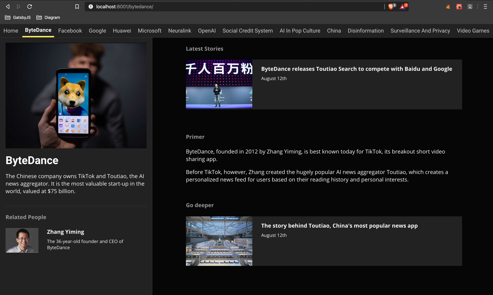

Diagram.news is a news blog I soft launched in August. It covers artificial intelligence, but will gradually report on other topics as the site grows.

Diagram publishes concise and easy-to-read posts, and creates live section pages for news events, big companies and long term trends.

Users can find related people biographies on every page, along with background information and longreads when they want to go deep.

I don’t let stories die on the vine-- they get updated. The same topics and ideas come up over and over again in the news, so I keep them fresh and reusable.

