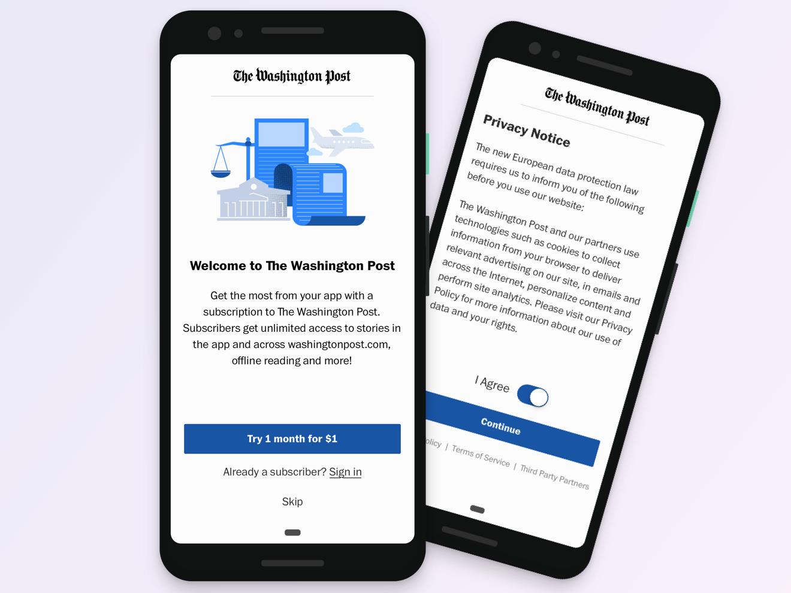

Most of my design work on the Post's native team focused on rethinking the national app ([App Store](https://apps.apple.com/us/app/washington-post-select/id938922398), [Play Store](https://play.google.com/store/apps/details?id=com.washingtonpost.rainbow&hl=en_US)). Instead of sinking months of time into a single, comprehensive redesign, my product manager and I decided to tackle individual problems and push out improvements iteratively.

### Redesigned onboarding

My last project at The Post was to revamp our onboarding experience. We wanted to create a new template to use in onboarding and general user education to inform users of new features and subscriber benefits.

At launch, we’re calling out the Post’s new Reading List, which allows users to save stories and read them offline across devices.

### App/Play Store revamp

For the App Store revamp, we explored what we want to communicate to first- and long-time users-- anyone who comes to our product page interested in what our app does. We determined what to write in combination with our newsroom stakeholders and user research.

### Rich notifications

We updated our notifications shortly after the iOS 12 rollout to include an image and our house fonts on every notification we send. We also created our first interactive notifications, which we used to cover results during the 2018 Midterms.

Below, I've included examples of both. We wanted to make something that made use of iOS 12's new functionality, and the Midterms seemed like an ideal opportunity to experiment with adding interactivity to our notifications.

### Recirculation module

The recirculation module is an end-of-article story carousel we launched last October. It aims to make use of a dead end at the bottom of articles, and boost depth to sections that don't get significant traffic.

I designed several UX options before landing on a carousel, which we chose because it's a navigational pattern users recognize and it's image-heavy (like the rest of our national app).

From there, I designed two versions of the carousel and made hi-fidelity prototypes in Principle:

After sharing these with newsroom stakeholders, my PM and others in product, we decided to use the card design on the right, which more closely resembled story cards we use elsewhere in the app.

We added this feature into a larger user test we ran late last summer. Every user recognized it as a carousel (small win, but still felt good).

Below is an example of spec I shared with developers:

We put a lot of thought into what stories should go into the carousel. In the end, we decided to emphasize stories from other sections, hoping that would help surface stories users would otherwise not see.

We launched it in October and it did very well against our KPIs.

### Core navigation

The improvement I've most enjoyed working on is a refresh of the app's core navigation, which involved us remapping the tab bar and child screens across the app, and bringing the Android and iOS versions to near parity. I can't share those designs, but I can talk about what we did:

**User testing**

We user tested prototypes twice. The first session was to gauge user response to three possible IA maps we were considering based on analytics, our hypotheses, and newsroom asks. I made bare bones InVision prototypes for this session.

Two months later, we tested the tweaked version with the stylistic changes we also wanted to make. That time, I made a high fidelity prototype with transitions, animations and other gesture-based actions using Framer.

###Documenting our styles in our new design system

The designs are complete, and I'm currently cleaning up Sketch symbols and styles and adding them to InVision DSM, a new design system management software that I want to use to help centralize the main design components for this app, as well as the colors, font styles, and spacing to keep things uniform.

