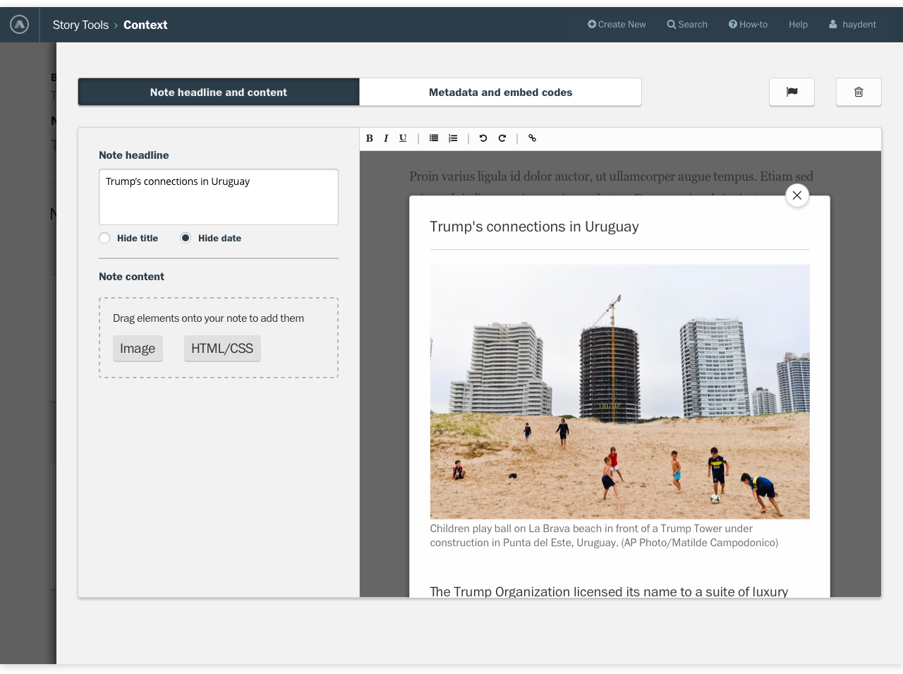
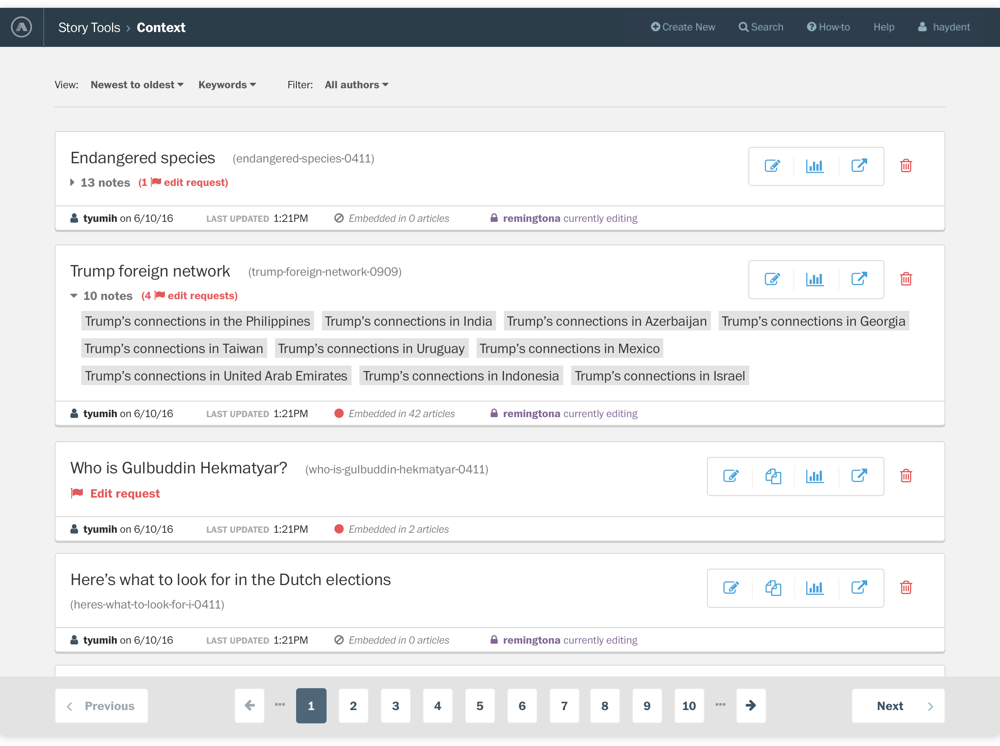
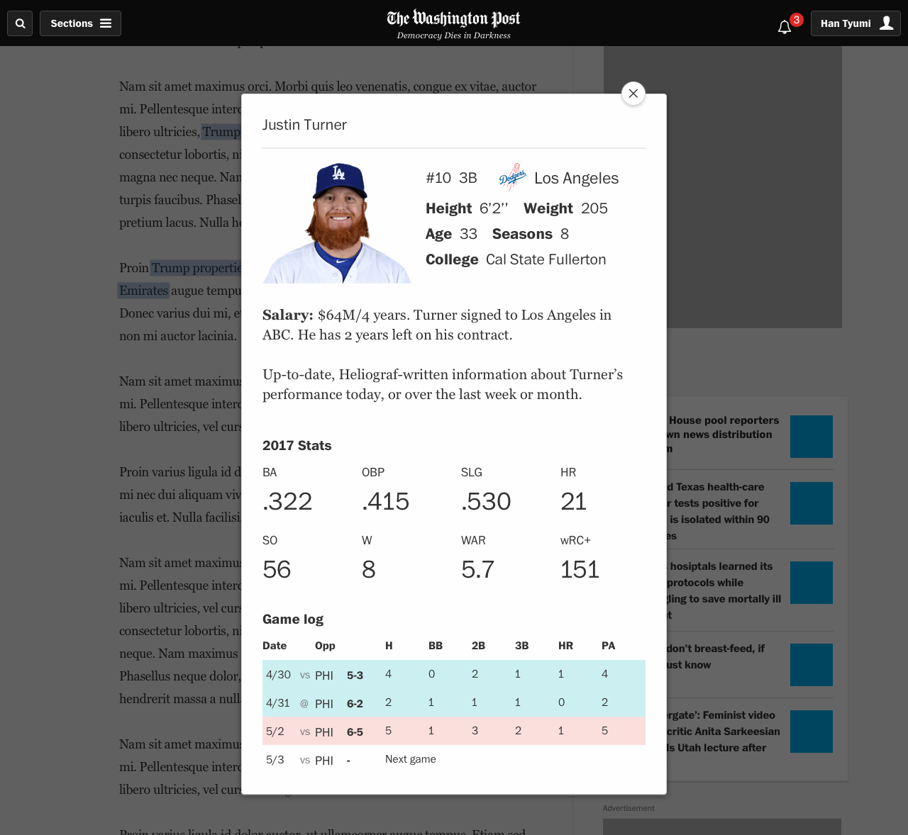
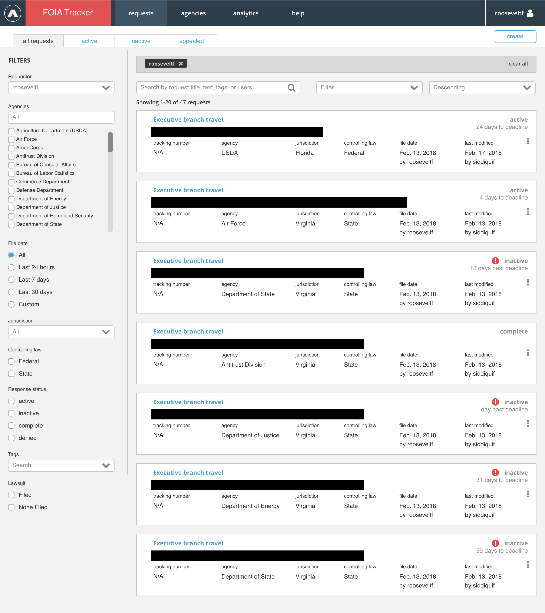
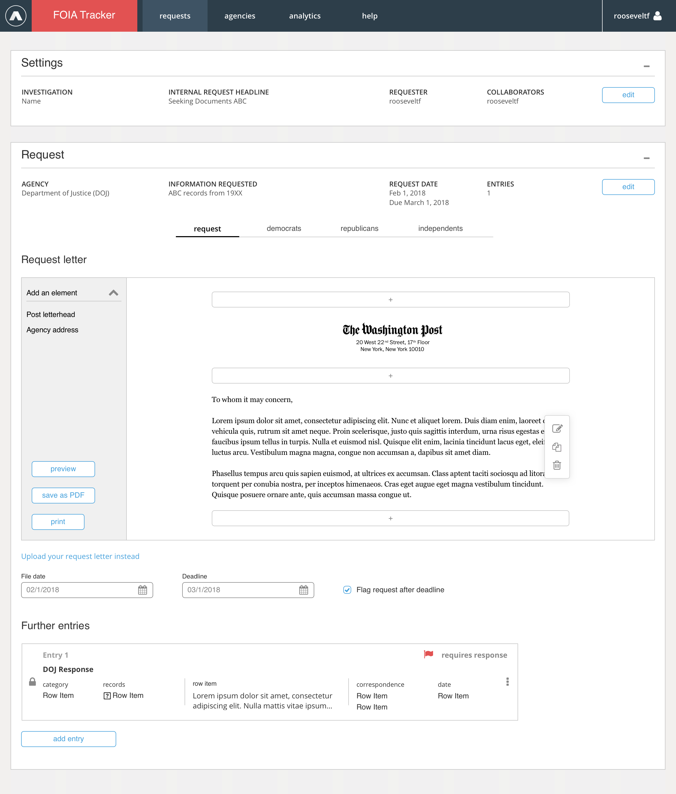

While on The Post's Story Tools team, I designed CMSs and other tools for the newsroom, a dashboard and admin for creating FOIA requests, and a live preview text editor that supported HTML and CMS code editing and images.

### Context admin and CMS

In addition to creating the end-user UI for our site, I also designed (and redesigned) a newsroom CMS for [The Post's annotation tool](https://www.niemanlab.org/2015/07/how-the-washington-post-built-and-will-be-building-on-its-knowledge-map-feature/).

In our previous admin, it was difficult for the newsroom to batch edit items, flag them for editors, and track editing history. So, we introduced a tagging system and redesigned the dashboard so that the newsroom can see when items were last edited, whether someone is currently editing an item, and in what articles the items are used.

The newsroom can also flag items for others to look at.

Below, an example of what our annotation looked like on the Washington Post site:

### FOIA tracker

FOIA tracker was a project to build an internal tool for Post reporters to write and track FOIA requests. It was designed to allow reporters and editors to write FOIA requests and then record and share contact information, average wait times, and agency points-of-contact. We also worked to add check-in reminders that made contacting and working with government agencies easier.

