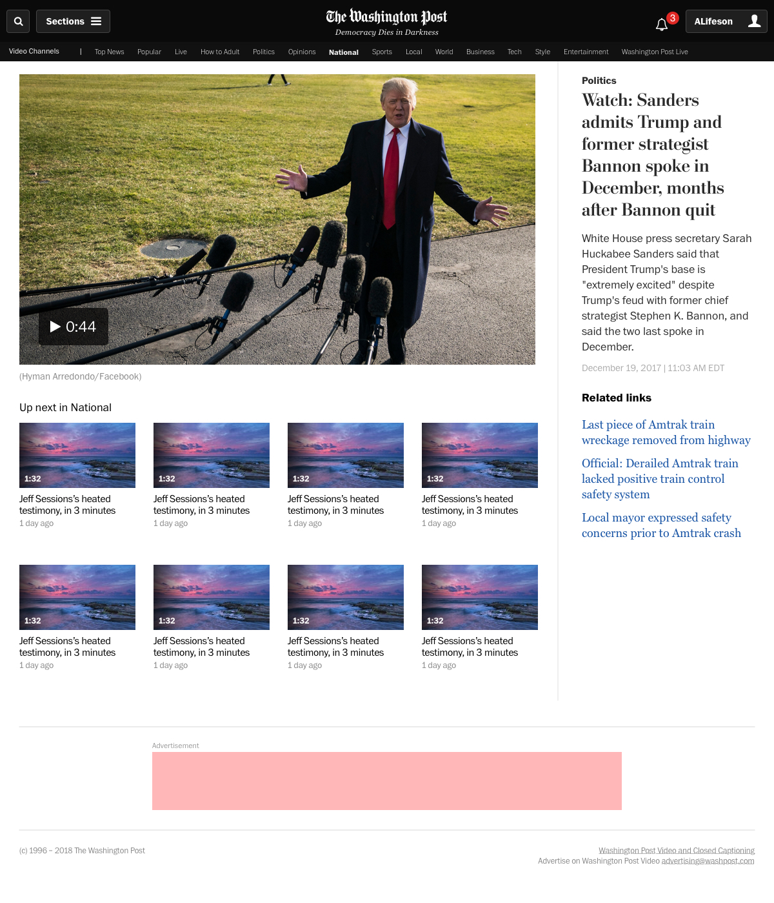
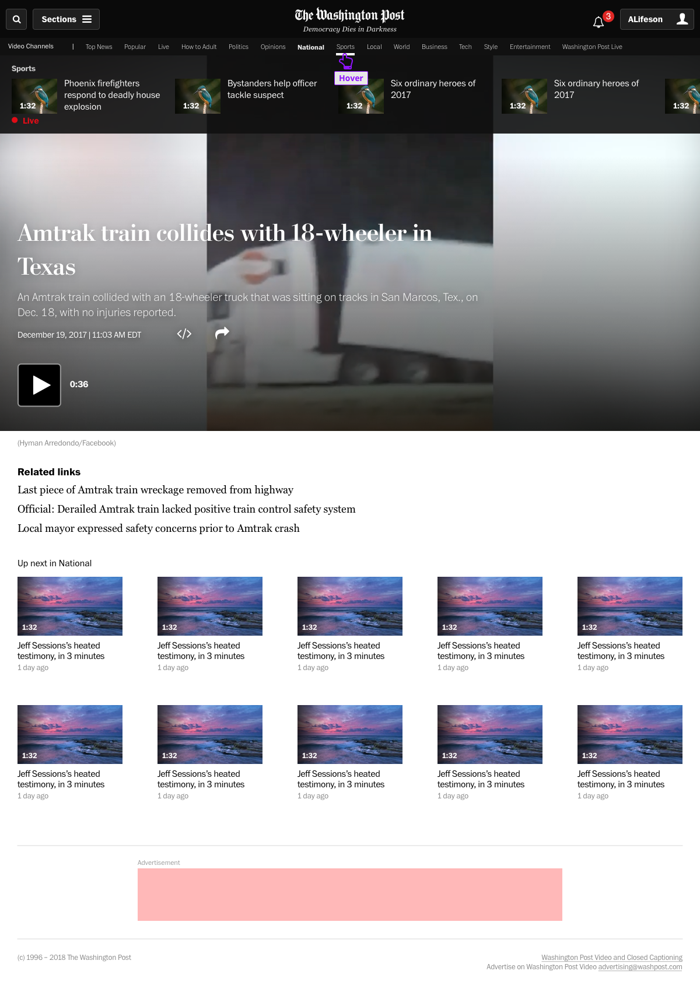
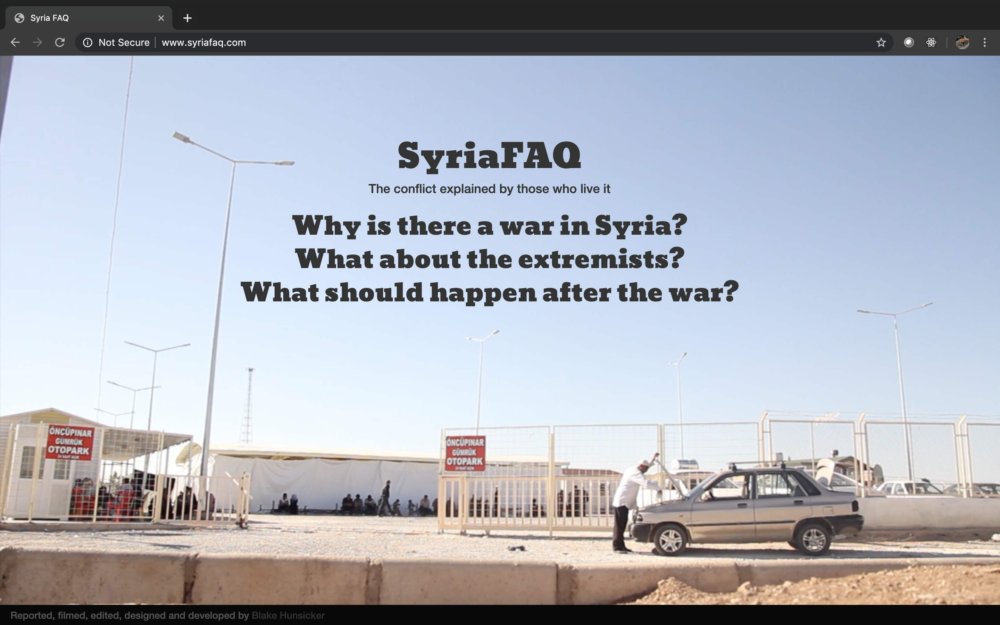

While at the Post, I redesigned The Post's video home page for desktop and mobile.

Our goal was to solve an inconvenience in the design, which originally required users to interact with a channel menu on the left side of the screen, and a video queue on the right. We moved the current video title and all relevant information above the fold, and increase visibility of other videos and channels.

**Our process**

This project required a fast turnaround, so I looked at all relevant analytics I could find and made two options for the video team. The designs above were the final comps.

**Afterthoughts**

We did a good first pass at reimagining our video homepage. I've since handed this off to another designer, who will focus on improving on my original designs.

If I was still in charge of design, I'd explore a simpler design that allows users to view videos in other sections, like this:

### SyriaFAQ

SyriaFAQ is a FAQ page about the Syrian war, made up of video interviews I conducted in Turkey with Syrian refugees in October, 2013. I was a grad student and research fellow at News Deeply at the time.

News Deeply's pilot site, Syria Deeply, had just launched and I was tasked with researching article templates. I was interested primarily in how they could flesh out their background sections that explained the conflict, the modern history of Syria and the context of the Arab Spring.

**Goal**

Explore how design and story framing can help introduce a topic as complex as the Syrian civil war. News sites aren't encyclopedias, but they can present intimidating information in a visually interesting and narrative way.

**Process**

I wanted to build a template and do the original reporting-- I was (and still am) interested in how design can inform the questions you ask sources, camera angles, b-roll, and so on.

I had a number of ideas, but settled on using a FAQ to frame the conflict around several big questions. I then raised the money to go to Kilis, Turkey to interview Syrian refugees in October, 2013.

I was inspired by [Snow Fall](http://www.nytimes.com/projects/2012/snow-fall/index.html#/?part=tunnel-creek), a huge interactive article that had come out several months before. But because it was only me, I chose to focus mainly on video, and edited the videos to stand alone, answering one question each.

**Afterthoughts**

I think this design has promise, but I don't like that the user has to open the videos individually-- if I could do it again, I'd design the page to play the videos one after another, and think more about how the three can be watched together. I'd also build a second page with further reading, photos, maps, and so on. It feels more like a companion piece or section of a larger story in hindsight.
